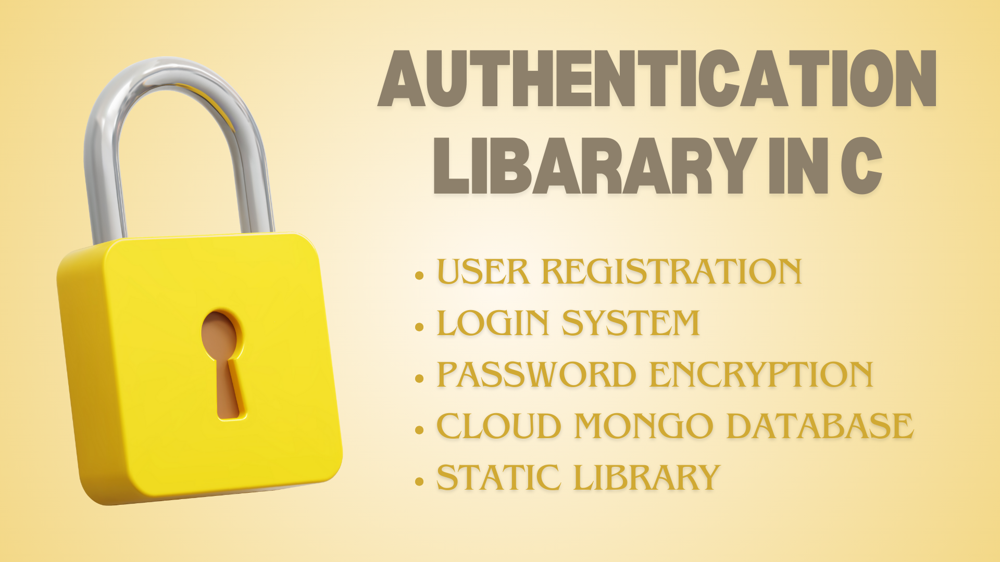

# Authentication Library in C



A static authentication library in C that provides **user registration**, **login**, and **password reset** out of the box. It handles password hashing (custom Singla Hashing algorithm), email verification via Gmail SMTP, and user storage in MongoDB — link a single `.a` file and call a few functions to add authentication to any C program.

[](#license)
[](#getting-started)
[](#)
[](#mongodb-setup)

---

## Table of Contents

- [Features](#features)
- [Architecture](#architecture)
- [Prerequisites](#prerequisites)
- [Getting Started](#getting-started)
  - [Linux (Native)](#linux-native)
  - [Docker (Any OS)](#docker-any-os)
- [API Reference](#api-reference)
  - [High-Level Functions](#high-level-functions)
  - [Hashing Functions](#hashing-functions)
  - [Database Functions](#database-functions)
  - [Utility Functions](#utility-functions)
- [Project Structure](#project-structure)
- [MongoDB Setup](#mongodb-setup)
- [Security](#security)
- [Brute Force Complexity](#brute-force-complexity)
- [Future Scope](#future-scope)
- [Contributing](#contributing)
- [Connect](#connect)
- [License](#license)

---

## Features

| Feature | Description |
|---------|-------------|
| **User Registration** | Name, email, and password with email format validation |
| **Login** | Password verification with a 5-attempt lockout |
| **Password Reset** | Email-verified password change flow |
| **Email Verification** | 6-digit codes sent via Gmail SMTP over TLS |
| **Password Hashing** | Custom Singla Hashing algorithm (3 private keys + 1 public key) |
| **MongoDB Storage** | Cloud (Atlas) or local, with TLS-secured connections |
| **Static Library** | Link `singlaAuth.a` + `singlaHash.a` into any C program |
| **Docker Support** | Run on any OS without installing native dependencies |
| **Secure Randomness** | Verification codes generated via `/dev/urandom` |

---

## Architecture

```
App.c (CLI Menu)
 |
 |-- [1] Login    --> pages/login.h
 |       |-- userExists()            (MongoDB lookup)
 |       |-- getPassword()           (retrieve hashed password)
 |       \-- compare()               (verify via singlaHash.a)
 |
 |-- [2] Signup   --> pages/signUp.h
 |       |-- checkEmail()            (format validation)
 |       |-- userExists()            (duplicate check)
 |       |-- enterAndHashPassword()  (hash via singlaHash.a)
 |       |-- generate_verf_code()    (random 6-digit code)
 |       |-- sendMail()              (Gmail SMTP)
 |       \-- insertUser()            (MongoDB insert)
 |
 \-- [3] Reset    --> pages/reset.h
         |-- userExists()
         |-- generate_verf_code() + sendMail()
         |-- enterAndHashPassword()
         \-- updateUser()            (MongoDB update)
```

**Database Schema (MongoDB):**

```json
{
  "name": "string",
  "email": "string (unique)",
  "password": "string (Singla-hashed)"
}
```

---

## Prerequisites

### 1. Gmail App Password

Required for sending verification emails.

1. Go to [Google App Passwords](https://myaccount.google.com/apppasswords)
2. Generate an App Password for "Mail"
3. Save the 16-character password — you will need it during setup

### 2. MongoDB

A valid MongoDB connection URI. Either:

- **Local:**
  ```
  mongodb://localhost:27017/testdb
  ```
- **Atlas Cloud (recommended):**
  ```
  mongodb+srv://<username>:<password>@<cluster>.mongodb.net/?retryWrites=true&w=majority
  ```

See the [MongoDB Setup](#mongodb-setup) section for step-by-step instructions.

### 3. Linux or Docker

| Method | Requirement |
|--------|-------------|
| **Native** | Linux/Unix system (Ubuntu, Debian, etc.) |
| **Docker** | Docker Desktop on Windows, macOS, or Linux |

---

## Getting Started

### Linux (Native)

```bash
# 1. Clone the repository
git clone https://github.com/harshit391/Authentication-Library-C.git
cd Authentication-Library-C

# 2. Run the setup script (installs gcc, libmongoc, libcurl, pkg-config)
#    You will be prompted for: project path, Gmail, App Password, MongoDB URI
chmod +x Linux-Setup.sh
./Linux-Setup.sh

# 3. Build the static library
chmod +x Auth-Setup.sh
./Auth-Setup.sh

# 4. Compile and run
chmod +x app.sh
./app.sh
```

**Or compile manually:**

```bash
gcc App.c -L. singlaAuth.a hash/singlaHash.a -o singla-auth \
    $(pkg-config --cflags --libs libmongoc-1.0) -lcurl
./singla-auth
```

### Docker (Any OS)

No native Linux system required. Docker handles all dependencies.

**Using `docker run`:**

```bash
# Build the image
docker build -t singla-auth .

# Run interactively with your credentials
docker run -it \
  -e MONGO_URI='<your-mongodb-uri>' \
  -e MAIL_USER='you@gmail.com' \
  -e MAIL_PASS='your-app-password' \
  singla-auth
```

**Using `docker compose`:**

```bash
# Create a .env file with your credentials
cat > .env << 'EOF'
MONGO_URI=<your-mongodb-uri>
MAIL_USER=you@gmail.com
MAIL_PASS=your-app-password
EOF

# Build and run
docker compose run singla-auth
```

> **Note:** The pre-compiled `singlaHash.a` targets x86_64 Linux. The Dockerfile is pinned to `linux/amd64` and will run via emulation on ARM machines (e.g., Apple Silicon).

---

## API Reference

### High-Level Functions

| Function | Description |
|----------|-------------|
| `void login()` | Interactive login flow. Prompts for email and password, verifies against database. Allows 5 password attempts before exiting. |
| `void signup()` | Interactive registration flow. Validates email, checks for duplicates, sends verification code, and inserts user into MongoDB. |
| `void resetPass()` | Interactive password reset. Verifies email, sends verification code, and updates the password in MongoDB. |

### Hashing Functions

| Function | Description |
|----------|-------------|
| `void enterAndHashPassword(char output[])` | Prompts for a password and stores the hashed result in `output`. |
| `void encode(char input[], char output[])` | Hashes `input` and stores the result in `output`. |
| `void decode(char dbpassword[], char output[])` | Decodes a hashed value and stores the result in `output`. |
| `bool compare(char dbpassword[], char userpassword[])` | Returns `true` if the user-entered password matches the stored hash. |

### Database Functions

| Function | Description |
|----------|-------------|
| `void insertUser(char name[], char password[], char email[])` | Inserts a new user document into MongoDB. Assumes password is already hashed. |
| `void updateUser(char email[], char newPass[])` | Updates the password for the user matching `email`. Assumes `newPass` is already hashed. |
| `bool userExists(char email[])` | Returns `true` if a user with the given email exists in the database. |
| `bool getPassword(char email[], char output[], size_t size)` | Retrieves the hashed password for the user matching `email`. Returns `true` on success. |

### Utility Functions

| Function | Description |
|----------|-------------|
| `int sendMail(char recipient[], char code[])` | Sends a verification email via Gmail SMTP. Returns `0` on success. |
| `void generate_verf_code(char output[], int n)` | Generates a random numeric code of length `n - 1` using `/dev/urandom`. |
| `void getDataFromFile(char output[], char path[], size_t size)` | Reads a config file into `output`, bounded by `size`. |

---

## Project Structure

```
Authentication-Library-C/
├── App.c                          Main entry point (interactive CLI menu)
├── singlaheader.h                 Central header (libraries + project includes)
├── singlaAuth.a                   Pre-built static library
│
├── hash/
│   └── singlaHash.a               Pre-compiled hashing library (x86_64)
│
├── pages/
│   ├── login.h                    Login flow with 5-attempt lockout
│   ├── signUp.h                   Registration flow with email verification
│   └── reset.h                    Password reset flow
│
├── database/
│   ├── src/
│   │   ├── userExists.h           MongoDB user lookup + password retrieval
│   │   ├── insertDB.h             MongoDB insert + update operations
│   │   └── sendmail.h             Gmail SMTP email sending via cURL
│   ├── utils/
│   │   ├── getData.h              File I/O utilities
│   │   └── generateCode.h         Secure random verification code generator
│   └── files/                     Runtime config (gitignored)
│       ├── mongouri.txt           MongoDB connection string
│       ├── mailuser.txt           Gmail address
│       └── mailpass.txt           Gmail app password
│
├── Linux-Setup.sh                 Dependency installer + credential setup
├── Auth-Setup.sh                  Static library builder
├── app.sh                         Compile + run script
├── Dockerfile                     Docker build definition (linux/amd64)
├── docker-entrypoint.sh           Docker runtime config from env vars
├── docker-compose.yml             Docker Compose service definition
└── .dockerignore                  Docker build context exclusions
```

---

## MongoDB Setup

### Local Instance

1. [Download MongoDB Community Server](https://www.mongodb.com/try/download/community)
2. Add the bin directory to your PATH
3. Start MongoDB:
   ```bash
   mongod --dbpath /data/db
   ```
4. Use the connection URI: `mongodb://localhost:27017/testdb`

### Atlas Cloud (Recommended)

1. [Create a free account](https://account.mongodb.com/account/login)
2. Create a new project and select the **Free** cluster tier (M0)
3. Create a database user (note the username and password)
4. Go to **Network Access** > **Allow Access from Anywhere** (or add your IP)
5. Go to **Connect** > **Drivers** > select **C**
6. Copy the connection string and replace `<password>` with your database user password
7. Delete any sample collections in **Browse Collections** (optional)

---

## Security

| Area | Implementation |
|------|----------------|
| **Password Storage** | Hashed with Singla Hashing algorithm — never stored in plaintext |
| **Verification Codes** | Generated from `/dev/urandom` for cryptographic randomness |
| **Email Delivery** | Gmail SMTP over TLS (port 587) with SSL certificate verification |
| **Database Connections** | TLS-secured MongoDB connections with 5-second timeout |
| **Input Handling** | All `scanf` calls use field-width specifiers to prevent buffer overflows |
| **Buffer Safety** | All file reads bounded by output buffer size |
| **Credential Storage** | Config files set to mode `600`; Docker uses environment variables |
| **Error Handling** | Database functions return success/failure; callers verify before proceeding |
| **Brute Force Protection** | 5-attempt limit on login, signup verification, and password reset |

---

## Brute Force Complexity

The Singla Hashing algorithm uses mathematical operations with 3 private secret keys and 1 public key.

**Time complexity:** O(95^n) where n is the password length.

| Password Length | Combinations     | Feasibility                  |
|-----------------|------------------|------------------------------|
| 4-6 characters  | ~10^8 to ~10^12  | Time-consuming but possible  |
| 7-10 characters | ~10^14 to ~10^20 | Extremely challenging        |
| 11+ characters  | 10^22+           | Practically infeasible       |

Each additional character increases difficulty by a factor of 95 (printable ASCII).

---

## Future Scope

- Token-based session authentication (JWT)
- GUI interface
- Integration with system-level SSO
- Support for additional database backends (PostgreSQL, SQLite)
- Multi-factor authentication (TOTP)
- Account lockout with timed cooldown
- Logging and audit trail

---

## Contributing

Contributions are welcome. To get started:

1. Fork the repository
2. Create a feature branch: `git checkout -b feature/your-feature`
3. Commit your changes: `git commit -m "Add your feature"`
4. Push to the branch: `git push origin feature/your-feature`
5. Open a Pull Request

---

## Connect

**Harshit Singla** - [LinkedIn](https://www.linkedin.com/in/harshitsingla1761/) - harshitsingla1761@gmail.com

Project Link: [https://github.com/harshit391/Authentication-Library-C](https://github.com/harshit391/Authentication-Library-C)

---

## License

Distributed under the MIT License. See `LICENSE` for more information.
